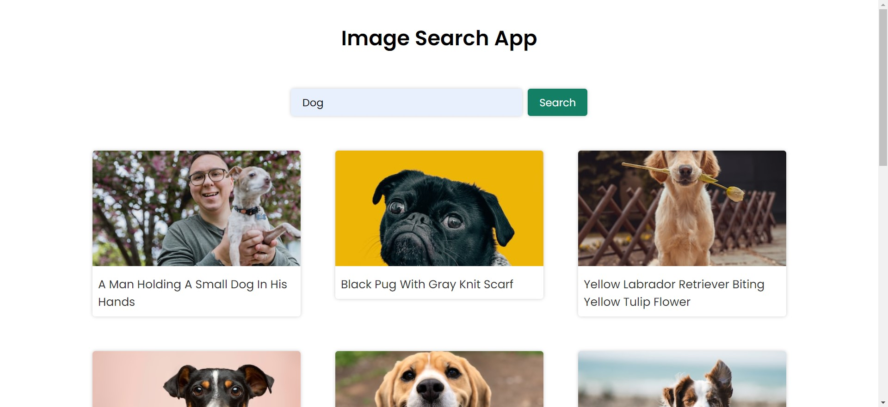
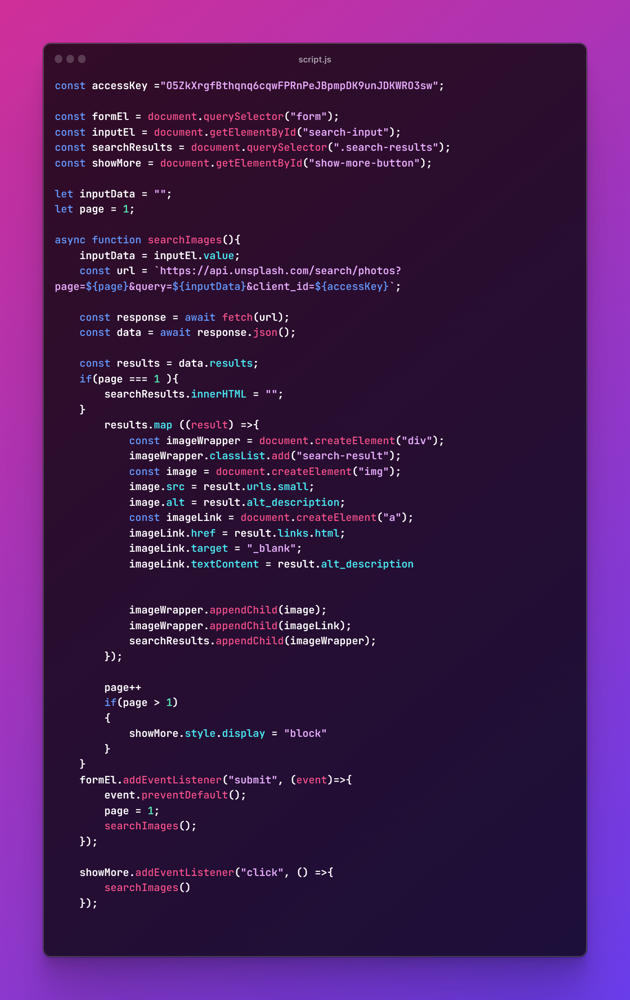

# Image Search Application



## Overview

This is a simple Image Search Application created with HTML, CSS, and JavaScript. It allows users to search for images and view the results in an interactive interface.

## Demo


[View Demo](#) <!-- Insert the link to your live demo here -->

## Features

- **Image Search**: Easily search for images.
- **Responsive Design**: Works seamlessly on various screen sizes.
- **Thumbnail View**: Browse search results as thumbnails.
- **Full-Screen Preview**: Click on images to view them in full-screen mode.
- **Lightweight**: Designed for performance and efficiency.
## Code Snippets



## Getting Started

To run this application locally, follow these steps:

1. Clone this repository:

   ```bash
   git clone https://github.com/Khirasagar/Image-search-app.git
Open index.html in your preferred web browser.
Usage
Enter a search query in the search bar and press Enter.
Browse the search results in the thumbnail view.
Click on an image to view it in full-screen mode.
Contributing
We welcome contributions! If you'd like to contribute to this project, please follow these guidelines:

Fork the repository.
Create a new branch for your feature: git checkout -b feature-name.
Make your changes and commit them: git commit -m 'Add new feature'.
Push to the branch: git push origin feature-name.
Submit a pull request.
License
This project is licensed under the MIT License - see the LICENSE file for details.

Contact
Your Name
GitHub: github.com/Khirasagar
Email: khirasagar.maharana8100@gmail.com
